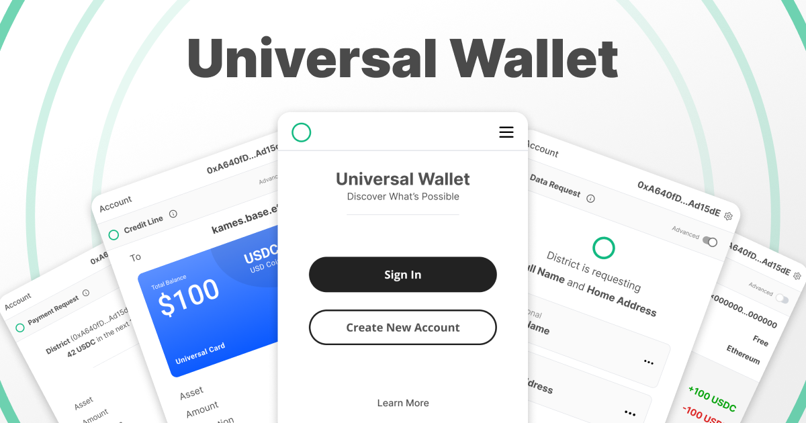

# Universal Wallet

Universal is an Open Source stack for building *savage* smart wallets for Ethereum.

[Demo](https://wallet.districtlabs.com)

The monorepo contains the following packages:

- `universal-wallet-sdk`: Wallet provider SDK to communicate with `universal-wallet-app` popup.
- `universal-wallet-connector`: A WAGMI connector for the `universal-wallet-sdk` package.
- `universal-wallet-app`: A popup app to communicate with the `universal-wallet-sdk` package.

The SDK is designed to work with the [Universal Wallet]() smart contracts.

## Usage

1. Setup the Universal Wallet Popup environment variables.
2. Setup the Delegations API environment variables.
3. Setup the Universal Wallet Dashboard environment variables.

### Develop

To develop all apps and packages, run the following command:

```bash
pnpm dev
```


### Build

To build all apps and packages, run the following command:

```bash
pnpm build
```

## Core Contributors

- [Vitor Marthendal](https://x.com/VitorMarthendal) | [District Labs, Inc](https://www.districtlabs.com/)
- [Kames Geraghty](https://x.com/KamesGeraghty) | [District Labs, Inc](https://www.districtlabs.com/)

## License

This project is licensed under MIT where applicable. See the [LICENSE](./LICENSE) file for more details.

And respects the licenses of the original projects that were forked.
